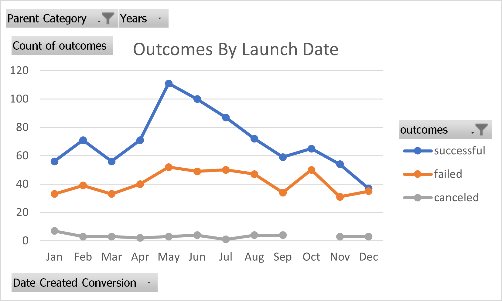

# You Give Me *Fever*

## **Overview of Project**
Louise has just finished fundraising for her play *Fever* and, although she came $400 short of her fundraising goal, she needs information on how to make her play as successfull as possible.

### **Purpose**
I've been hired by Louise to perform a detailed data analysis on how the launch date and the goal of a campaign affect its success. To provide this information, I have analyzed the Kickstarter data for a multitude of similar campaigns. My goal is to produce a report that will allow Louise to make the best data-driven decisions and insure her campaign is succesful. 

---
## **Analysis and Challenges**

### **Analysis of Outcomes Based on Launch Date**
Since Louise wanted information on how the success of a theater campaign is affected by the lauch date, I determined which months had the most succesful campaigns and which months had the most failed campaigns. To do this, I converted the Unix timestamps in the Kickstarter data into dates in the month-day-year format. I, then, made  a pivot table and a pivot chart to help Louise visualize which months had the greatest amount of succesful campaigns and which had the greatest amount of failed campaigns: 

 

---
### **Analysis of Outcomes Based on Goals**
To complete the analysis of outcomes based on goals, I created a table showing the number of successful, failed  and canceled campaigns along with their rates over twelve different intervals, starting with campaigns that had goals of less than $1000 and then incrementing the interval for every $5000 until reaching goals of $50000 or more: 

I, then, made a line graph showing the percentage of successful, failed and canceled campaigns according to each interval: 

---
### **Challenges and Difficulties Encountered**
One challenge I encountered was understanding the Unix Timestamps included in the Kickstarter data for the deadline and launched_at columns of each campaign. Once I discovered that the Unix Timestamps represent the number of seconds since midnight of January 1, 1970, I was able to divide the timestamp by number of seconds, minutes and hours in a day and then add it to January 1, 1970 to create the Date Created Converion and Date Ended Conversion columns of the Kickstarter data.

Another challenge I faced was the best way to connect the information that Louise wanted to how she should use the data in her campaigns. Louise asked for the outcomes of theater campaigns based on their launch date and the outcomes of play campaigns based on their goal; the first one is comparing a parent category to a factor of the campaign and the second one is comparing a subcategory of that parent category to a different factor of the campaign. The best way to present the data to Louise is to convey the limitations of the data that she is asking for. Even though the data in my analysis is useful in terms of the Launch Date and Goals, I will suggest other factors that could affect the success of her campaign, such as campaign length or location, to give her a more well-rounded analysis.    

---
## Results

- **What are two conclusions you can draw about the Outcomes based on Launch Date?**

    The first conclusion that I can draw from the data on the Outcomes based on Launch Date is that the best months to launch campaigns are May and June. They were the only two months in the analysis that had more than 100 successful campaigns. May, in particular, had the greatest amount of succesful campaigns with 111, which is about 50% more successful campaigns than the month of April, which only had 71.

    Additionally, the worst month to start a campaign is December, which had by far the least amount of successful campaigns with 37. In fact, according to the Kickstarter data, there is about a 50/50 chance that a campaign launched in December will fail since the data shows 35 failed campaigns in December.

---
- **What can you conclude about the Outcomes based on Goals?**
    
    The main conclusion that I can make about the outcomes based on goals is that the goal of the campaign does not have much bearing on the successs of the campaign. Three-quarters of the campaigns with goals less than $5000 have success and two-thirds of the campaigns with goals from $35000 to $45000 have success. Meanwhile, only around half of the campaigns with goals above $5000 but less than $25000 are successful. The success rate drops to around one-quarter for the campaigns with goals from $25000 to $35000 and almost completely bottoms out to one-eighth of the campaigns with goals above $45000.
---
- **What are some limitations of this dataset?**
    
    There are several limitations to the Kickstarter dataset. First of all, the dataset doesn't take into account the organization doing the fundraising or the type of fundraising done, which both could the affect the success of the campaign, in addition to the launch date and the goal of the campaign. Organizations with more fundraising experience and connections are more likely to meet their campaign goals than organization that don't.

    Second of all, while the Kickstarter data does list the launch date and the end date of each campaign, the dataset doesn't directly address the length of each campaign. An analysis of this aspect of the campaigns would be very helpful in determining how the length of the campaign affects its success and the best course of action to take for fundraising.

    Lastly, and what I think skews the outcomes based on goals the most is the small sample size of campaigns with goals above $25000. Since it very difficult for many organizations to raise that much money, it stands to reason that there are only 42 such campaigns and additionally there are only 10 campaigns with goals from $35000 to $50000. That small of a smaple size makes it extremely difficult to draw conclusions from that particular section of the data.
---
- **What are some other possible tables and/or graphs that we could create?**

    Several other tables and graphs would aid in an anaylsis of the success of the campaigns. Firstly, an Outcomes vs Launch Date line graph based on the subcategory *Plays* would help to pare down the data and show how the launch date affets the fundraising for plays instead of theaters in general, which is the information that Louise is seeking: 
    
     
    
    Secondly, a graph showing the percentage of successful and failed campapigns according to the month would be informative. May, in particular, has the highest amount of successful campaigns but it also has the highest amount of failed campaigns. Comparing the rate of successful compaigns for each month is a fairer comparison for the months than the straight counts are:

    
     
    Thirdly, a graph showing success of campaign versus length of campaign would be useful to show the ideal length of a campaign:

    

    Lastly, a graph showing successful and failed campaigns based on location can aid in the analysis of if the location of the campaign affects the outcome of the campaign: 

    
